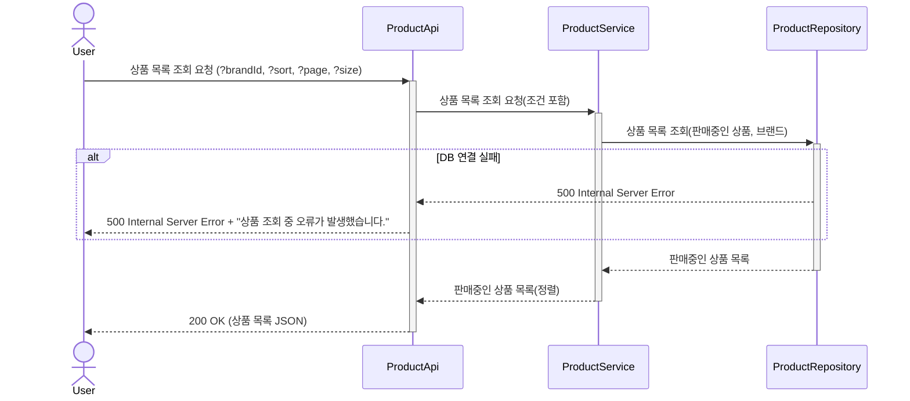
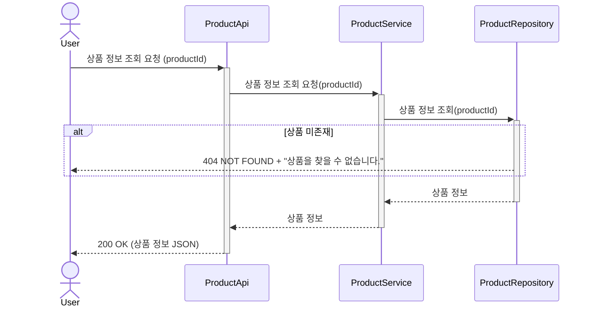
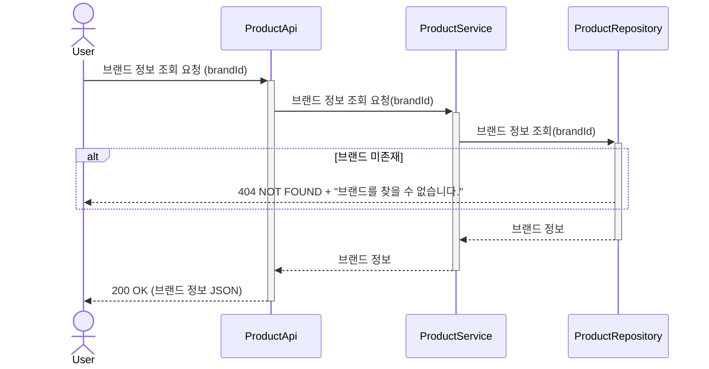
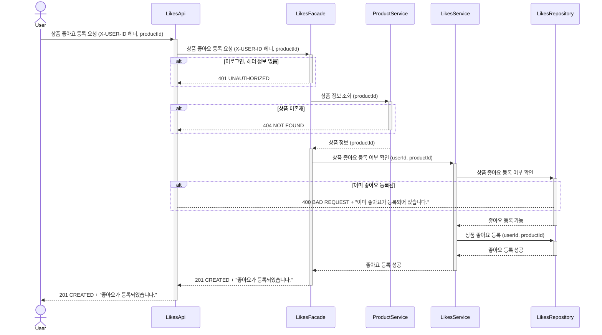
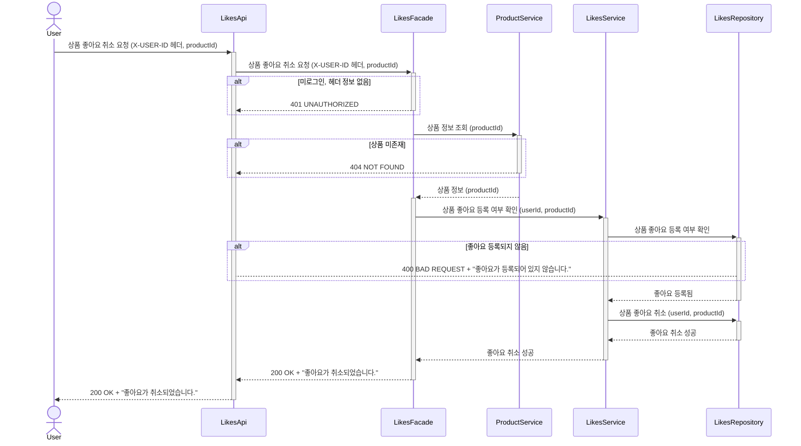
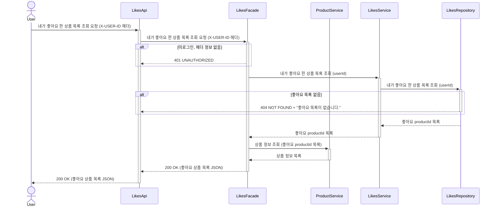
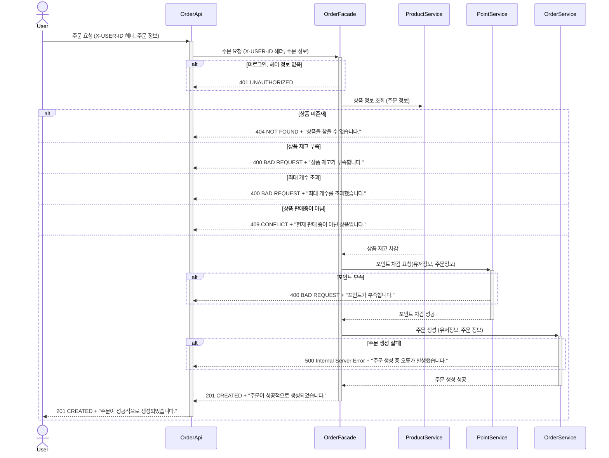
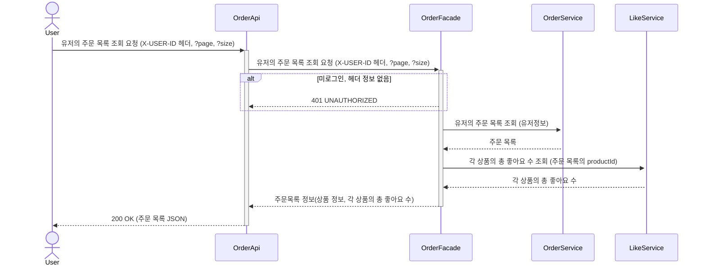
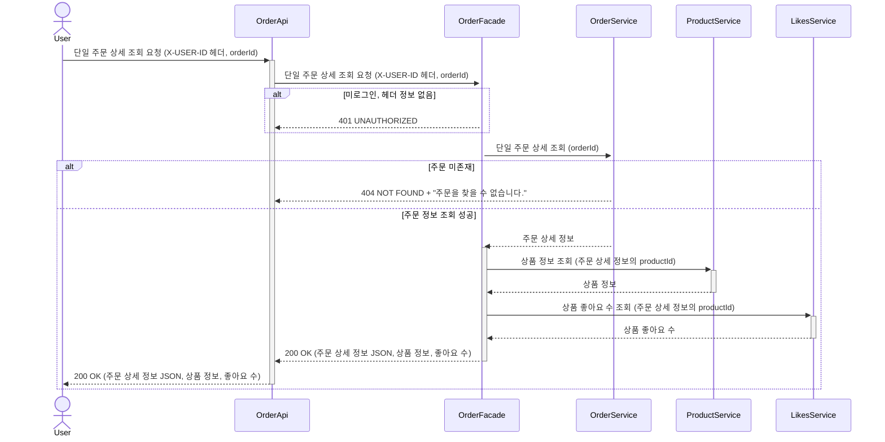

# 🏷 브랜드 & 상품 (Brands / Products)

## 1. 상품 목록 조회

## 2. 상품 정보 조회

## 3. 브랜드 정보 조회

# ❤️ 좋아요 (Likes)

## 4. 상품 좋아요 등록

## 5. 상품 좋아요 취소

## 6. 내가 좋아요 한 상품 목록 조회

# 🧾 주문 / 결제 (Orders)

## 7. 주문 요청

## 8. 유저의 주문 목록 조회

## 9. 단일 주문 상세 조회

