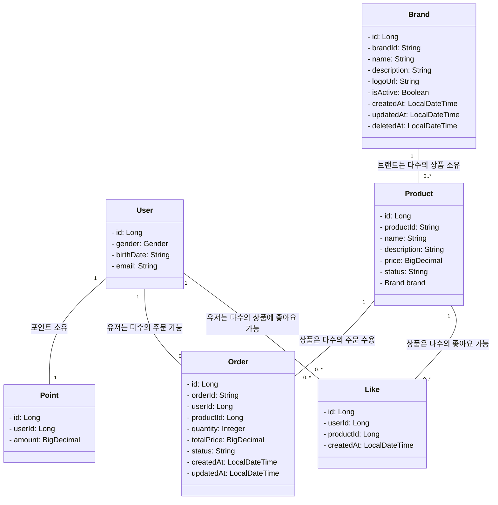

```mermaid
classDiagram

    class User {
        - id: Long
        - gender: Gender
        - birthDate: String
        - email: String
    }
    
    class Point {
        - id: Long
        - userId: Long
        - amount: BigDecimal
    }
    
    class Brand {
        - id: Long
        - brandId: String
        - name: String
        - description: String
        - logoUrl: String
        - isActive: Boolean
        - createdAt: LocalDateTime
        - updatedAt: LocalDateTime
        - deletedAt: LocalDateTime
    }
    
    class Product {
        - id: Long
        - productId: String
        - name: String
        - description: String
        - price: BigDecimal
        - status: String
        - Brand brand
    }
    
    class Like {
        - id: Long
        - userId: Long
        - productId: Long
        - createdAt: LocalDateTime
    }
    
    class Order {
        - id: Long
        - orderId: String
        - userId: Long
        - productId: Long
        - quantity: Integer
        - totalPrice: BigDecimal
        - status: String
        - createdAt: LocalDateTime
        - updatedAt: LocalDateTime
    }

    User "1" -- "1" Point : 포인트 소유
    User "1" -- "0..*" Order : 유저는 다수의 주문 가능
    User "1" -- "0..*" Like : 유저는 다수의 상품에 좋아요 가능

    Brand "1" -- "0..*" Product : 브랜드는 다수의 상품 소유

    Product "1" -- "0..*" Order : 상품은 다수의 주문 수용
    Product "1" -- "0..*" Like : 상품은 다수의 좋아요 가능
    
    
```
