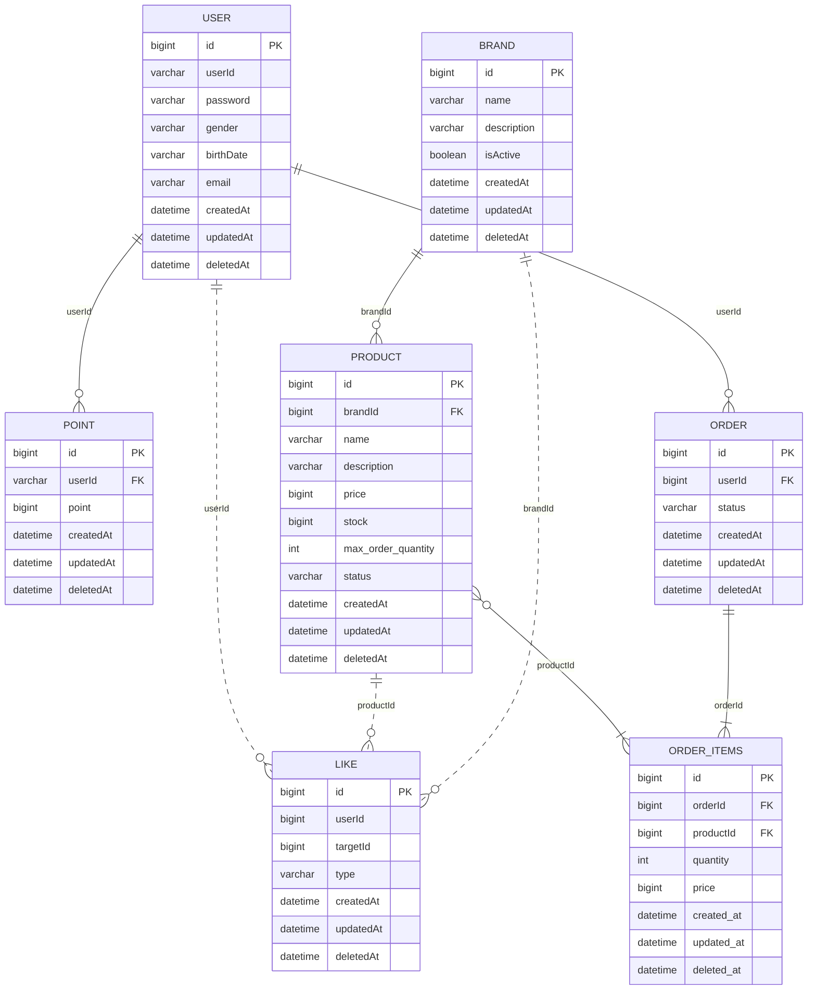

```mermaid
erDiagram

    USER {
        bigint id PK
        varchar userId
        varchar password
        varchar gender
        varchar birthDate
        varchar email
        datetime createdAt
        datetime updatedAt
        datetime deletedAt
    }
    
    POINT {
        bigint id PK
        varchar userId FK
        bigint point
        datetime createdAt
        datetime updatedAt
        datetime deletedAt
    }
    
    BRAND {
        bigint id PK
        varchar name
        varchar description
        boolean isActive
        datetime createdAt
        datetime updatedAt
        datetime deletedAt
    }
    
    PRODUCT {
        bigint id PK
        bigint brandId FK
        varchar name
        varchar description
        bigint price
        bigint stock
        int max_order_quantity
        varchar status
        datetime createdAt
        datetime updatedAt
        datetime deletedAt
    }

    LIKE {
        bigint id PK
        bigint userId
        bigint targetId
        varchar type
        datetime createdAt
        datetime updatedAt
        datetime deletedAt
    }
    
    ORDER {
        bigint id PK
        bigint userId FK
        varchar status
        datetime createdAt
        datetime updatedAt
        datetime deletedAt
    }
    
    ORDER_ITEMS {
        bigint id PK
        bigint orderId FK
        bigint productId FK
        int quantity
        bigint price
        datetime created_at
        datetime updated_at
        datetime deleted_at
    }
    


    USER ||--o{ POINT : "userId"
    
    BRAND ||--o{ PRODUCT : "brandId"
    
    USER ||..o{ LIKE : "userId"
    PRODUCT ||..o{ LIKE : "productId"
    BRAND ||..o{ LIKE : "brandId"
    
    USER ||--o{ ORDER : "userId"
    PRODUCT }o--|{ ORDER_ITEMS : "productId"
    ORDER ||--|{ ORDER_ITEMS : "orderId"

```
---
## mermaid - erDiagram 연결 설명
- |o : 선택
- || : 필수
- { : 다수
- -- : 식별관계
- .. : 비식별관계

